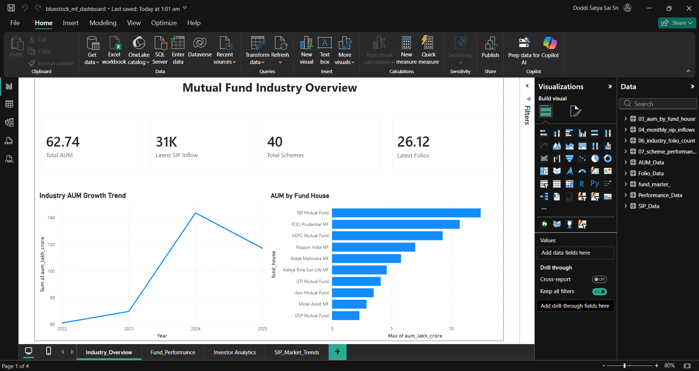
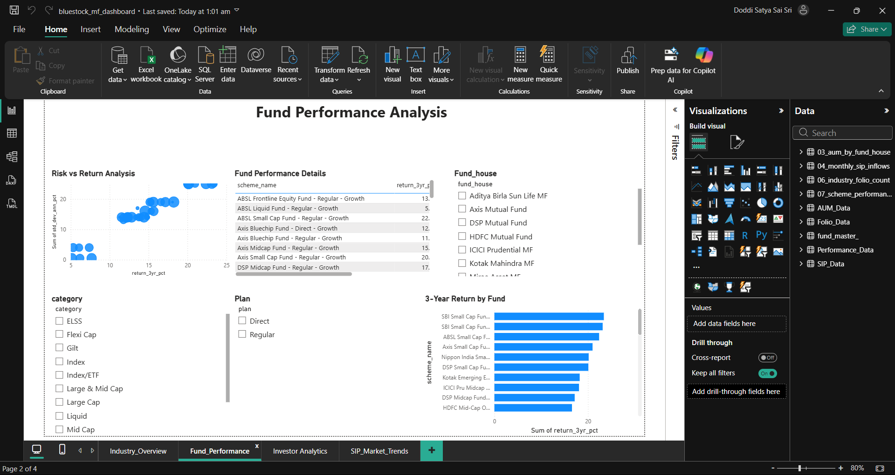
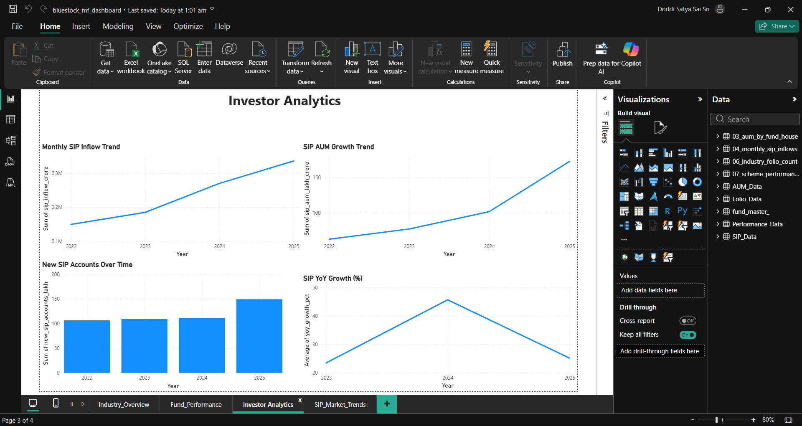
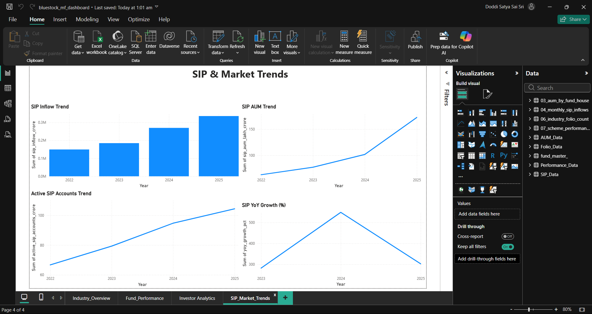

# 📊 Mutual Fund Analytics

## 📌 Project Overview

This project is a comprehensive **Mutual Fund Analytics** solution developed as part of the **Bluestock Fintech Internship**.

The project focuses on analyzing mutual fund data, fund performance, Assets Under Management (AUM), investor behaviour, SIP trends, and market trends using **Python, SQL, Jupyter Notebook, and Power BI**.

The complete workflow includes:

- Data ingestion
- Data cleaning and preprocessing
- Exploratory data analysis
- SQL-based analysis
- Fund performance analysis
- Investor and SIP analysis
- Power BI dashboard development
- Reporting and visualization

---

## 🎯 Project Objectives

The main objectives of this project are:

- Analyze mutual fund industry growth.
- Compare mutual fund performance.
- Study risk and return characteristics of different schemes.
- Analyze Assets Under Management (AUM).
- Understand investor and SIP behaviour.
- Track SIP inflows and SIP AUM growth.
- Build an interactive Power BI dashboard.
- Present insights in a clear and professional format.

---

## 📁 Project Structure

```text
Mutual-Fund-Analytics/
│
├── dashboard/
│   ├── Screenshots/
│   │   ├── Fund_Performance.png
│   │   ├── Industry_Overview.png
│   │   ├── Investor_Analytics.png
│   │   └── Sip_Market_Analysis.png
│   │
│   ├── bluestock_mf_dashboard.pbix
│   └── Mutual_Fund_Analytics_Dashboard.pdf
│
├── data/
│   ├── raw/
│   └── processed/
│
├── notebooks/
│   └── Performance_Analytics.ipynb
│
├── reports/
├── scripts/
├── sql/
│
├── bluestock_mf.db
├── requirements.txt
├── .gitignore
└── README.md
```

---

# 🔄 Data Ingestion

The first stage of the project involved collecting, loading, and exploring the mutual fund datasets.

The datasets were loaded using **Python and Pandas**.

### Tasks Performed

- Loaded the provided CSV datasets.
- Checked dataset dimensions using `.shape`.
- Examined column data types using `.dtypes`.
- Viewed sample records using `.head()`.
- Identified data quality issues.
- Explored mutual fund master information.
- Checked fund houses and fund categories.
- Validated AMFI codes.
- Collected additional NAV information using an API.

---

## 🌐 Live NAV Data Collection

Live/recent NAV data was fetched using the **MFAPI** for selected mutual fund schemes.

The API data was processed using Python and stored for further analysis.

This helped demonstrate the ability to work with both:

- Static datasets
- API-based financial data

---

# 🧹 Data Cleaning & Preprocessing

The raw datasets were cleaned and prepared before performing analysis.

### Major Activities

- Checked missing values.
- Verified column data types.
- Validated important identifiers.
- Checked AMFI codes across datasets.
- Organized raw and processed datasets.
- Prepared analytical datasets.
- Converted data into formats suitable for analysis.
- Prepared data for SQL and Power BI.

The processed data was then used for performance, investor, AUM, and SIP analysis.

---

# 🗄️ SQL & Database Analysis

SQL was used as part of the analytical workflow to query and analyze the mutual fund datasets.

A local database is included in the project:

```text
bluestock_mf.db
```

SQL analysis was used to support the analytical workflow and extract useful information from the processed datasets.

SQL-related work is maintained inside:

```text
sql/
```

---

# 📈 Fund Performance Analytics

Fund performance was analyzed using multiple return and risk indicators.

### Performance Metrics

- 1-Year Return
- 3-Year Return
- 5-Year Return
- Standard Deviation
- Sharpe Ratio
- Sortino Ratio
- Beta
- Maximum Drawdown
- Expense Ratio
- Risk Grade

These metrics help compare mutual fund schemes based on both **return potential and investment risk**.

The performance analysis is available in:

```text
notebooks/Performance_Analytics.ipynb
```

---

# 💰 Assets Under Management (AUM) Analysis

AUM analysis was performed to understand the size and growth of the mutual fund industry.

### Analysis Includes

- Industry AUM growth
- Year-wise AUM trends
- AUM comparison by fund house
- Identification of major fund houses

The analysis provides an overview of how mutual fund assets changed over time and how AUM is distributed among different fund houses.

---

# 👥 Investor Analytics

Investor-related data was analyzed to understand participation and investment behaviour.

### Analysis Includes

- SIP inflows
- SIP AUM growth
- New SIP accounts
- Active SIP accounts
- Year-over-year SIP growth
- Investor participation trends

These analyses help understand how systematic investment activity has changed over time.

---

# 📊 Power BI Dashboard

An interactive **Power BI dashboard** was developed to present the results of the Mutual Fund Analytics project.

The dashboard contains **four analytical pages**:

1. Mutual Fund Industry Overview
2. Fund Performance Analysis
3. Investor Analytics
4. SIP & Market Trends

---

# 1️⃣ Mutual Fund Industry Overview

The first dashboard page provides a high-level overview of the mutual fund industry.

### KPI Cards

- **Total AUM**
- **Latest SIP Inflow**
- **Total Schemes**
- **Latest Folios**

### Visualizations

- **Industry AUM Growth Trend**
- **AUM by Fund House**

This page provides a quick overview of industry size, growth, and fund-house-level AUM.

### Screenshot



---

# 2️⃣ Fund Performance Analysis

The second dashboard page focuses on comparing mutual fund schemes based on their risk and returns.

### Visualizations

- **Risk vs Return Analysis**
- **Fund Performance Details**
- **3-Year Return by Fund**

### Interactive Filters

- Fund House
- Category
- Plan

These filters allow users to dynamically explore and compare different mutual fund schemes.

### Screenshot



---

# 3️⃣ Investor Analytics

The third dashboard page focuses on SIP and investor-related analytics.

### Visualizations

- **Monthly SIP Inflow Trend**
- **SIP AUM Growth Trend**
- **New SIP Accounts Over Time**
- **SIP YoY Growth (%)**

This dashboard helps identify changes in SIP activity and investor participation over time.

### Screenshot



---

# 4️⃣ SIP & Market Trends

The fourth dashboard page provides a focused analysis of SIP market trends.

### Visualizations

- **SIP Inflow Trend**
- **SIP AUM Trend**
- **Active SIP Accounts Trend**
- **SIP YoY Growth (%)**

This page provides insights into systematic investment activity and its growth over time.

### Screenshot



---

# 📂 Dashboard Deliverables

All Power BI deliverables are stored inside the `dashboard` directory.

## Power BI Source File

```text
dashboard/bluestock_mf_dashboard.pbix
```

This file contains the complete interactive Power BI dashboard.

## PDF Dashboard Report

```text
dashboard/Mutual_Fund_Analytics_Dashboard.pdf
```

This contains the exported PDF version of the Power BI dashboard.

## Dashboard Screenshots

```text
dashboard/Screenshots/
```

The screenshots include:

- Industry Overview
- Fund Performance
- Investor Analytics
- SIP & Market Trends

---

# 🛠️ Technologies Used

| Technology | Purpose |
|---|---|
| Python | Data processing and analysis |
| Pandas | Data manipulation and preprocessing |
| NumPy | Numerical operations |
| SQL | Data querying and analysis |
| SQLite | Local database |
| Jupyter Notebook | Data analysis and experimentation |
| Power BI | Interactive dashboard development |
| DAX | Power BI calculations and measures |
| Power Query | Data transformation |
| Matplotlib | Data visualization |
| Plotly | Interactive visualization |
| Git | Version control |
| GitHub | Project repository and documentation |

---

# 🔍 Key Analytical Areas

The project covers several important areas of mutual fund analysis:

### Fund Analysis

- Fund performance
- Risk-return comparison
- Fund-house comparison
- Scheme-level analysis

### Industry Analysis

- AUM growth
- Industry trends
- Fund-house AUM distribution

### Investor Analysis

- SIP inflows
- New SIP accounts
- Active SIP accounts
- Investor participation

### Market Trend Analysis

- SIP AUM growth
- SIP YoY growth
- Historical SIP trends

---

# 💡 Key Insights

The project provides insights into:

- Mutual fund industry AUM growth.
- Performance differences between mutual fund schemes.
- Risk-return characteristics of different funds.
- AUM distribution across fund houses.
- Growth in SIP investments.
- Changes in SIP AUM.
- Growth in new and active SIP accounts.
- Year-over-year changes in SIP activity.
- Investor participation trends.

---

# 🔄 Project Workflow

```text
Raw Mutual Fund Data
        ↓
Data Ingestion
        ↓
Data Validation
        ↓
Data Cleaning & Preprocessing
        ↓
SQL / Database Analysis
        ↓
Python & Jupyter Analysis
        ↓
Fund Performance Analytics
        ↓
AUM & Investor Analytics
        ↓
SIP & Market Trend Analysis
        ↓
Power BI Dashboard
        ↓
Dashboard Screenshots
        ↓
PDF Report
        ↓
GitHub Documentation
```

---

# 📌 Project Deliverables

The repository currently contains:

- ✅ Project folder structure
- ✅ Raw mutual fund datasets
- ✅ Processed datasets
- ✅ Data ingestion workflow
- ✅ Data cleaning and preprocessing
- ✅ API-based NAV data collection
- ✅ Data validation
- ✅ SQL/database analysis
- ✅ Fund performance analytics
- ✅ AUM analysis
- ✅ Investor analytics
- ✅ SIP analysis
- ✅ Jupyter Notebook analysis
- ✅ Power BI dashboard
- ✅ Four dashboard pages
- ✅ Interactive Power BI filters
- ✅ Dashboard screenshots
- ✅ PDF dashboard report
- ✅ Power BI `.pbix` source file
- ✅ GitHub project documentation

---

# 📁 Important Files

| File/Folder | Description |
|---|---|
| `data/` | Raw and processed datasets |
| `notebooks/` | Jupyter Notebook analysis |
| `sql/` | SQL analysis |
| `scripts/` | Python scripts |
| `reports/` | Project reports |
| `dashboard/` | Power BI dashboard files |
| `dashboard/Screenshots/` | Dashboard screenshots |
| `bluestock_mf.db` | Project database |
| `requirements.txt` | Python dependencies |
| `README.md` | Complete project documentation |

---

# 🚀 How to Run the Project

## 1. Clone the Repository

```bash
git clone https://github.com/satyaa2429/Mutual-Fund-Analytics.git
```

## 2. Navigate to the Project

```bash
cd Mutual-Fund-Analytics
```

## 3. Install Required Python Packages

```bash
pip install -r requirements.txt
```

## 4. Open the Jupyter Notebooks

```bash
jupyter notebook
```

Open the required notebooks from the `notebooks/` directory.

## 5. Open the Power BI Dashboard

Open:

```text
dashboard/bluestock_mf_dashboard.pbix
```

using **Microsoft Power BI Desktop**.

---

# 📊 Dashboard Summary

The final Power BI solution provides an interactive analytical view of:

**Mutual Fund Industry → Fund Performance → Investor Analytics → SIP & Market Trends**

It combines the results of the data processing and analytical workflow into an easy-to-understand business intelligence dashboard.

---

# 👤 Author

**Doddi Satya Sai Sri**

B.Tech – Computer Science & Engineering (Data Science)

Centurion University of Technology and Management

---

# 💼 Internship Project

Developed as part of the **Bluestock Fintech Mutual Fund Analytics Internship Project**.

---

## ⭐ Project Status

**Mutual Fund Analytics Dashboard and analytical workflow completed.**
